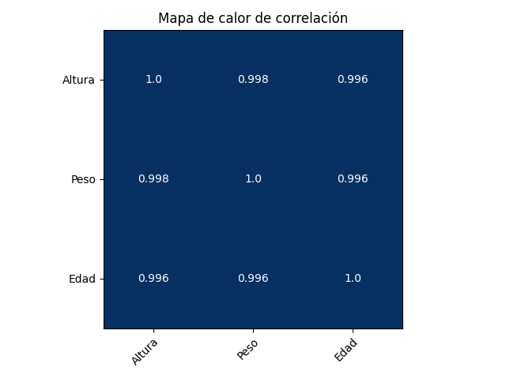
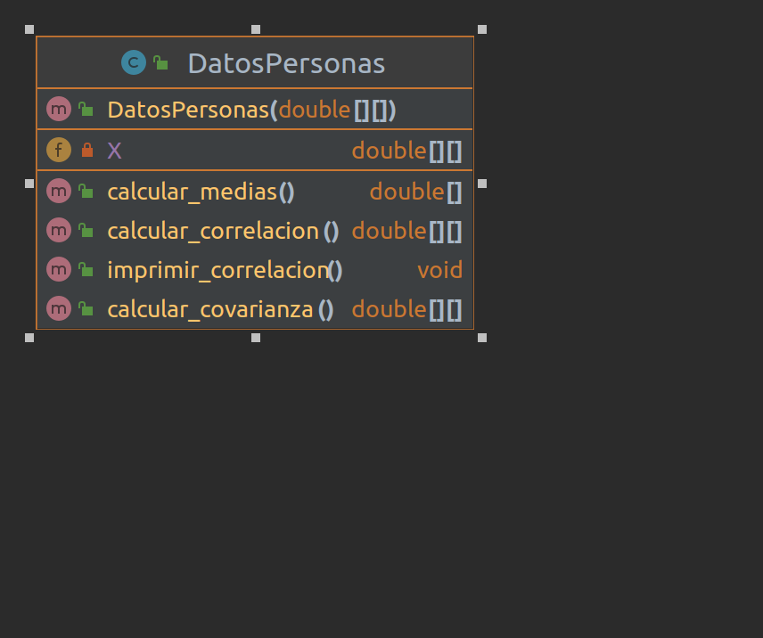

# Programación Orientada a Objetos en Java - Taller 01

## Cálculo de la matriz de correlación

**Introducción**:

La matriz de correlación es importante porque nos permite entender la relación entre diferentes variables. La correlación es una medida estadística que indica la fuerza y la dirección de una relación lineal entre dos variables. Un valor de correlación cercano a 1 indica una relación positiva fuerte entre las variables, mientras que un valor cercano a -1 indica una relación negativa fuerte. Un valor cercano a 0 indica que no hay una relación lineal fuerte entre las variables.

La matriz de correlación es especialmente útil cuando se trabaja con conjuntos de datos con muchas variables, ya que permite identificar patrones y relaciones entre ellas. También se puede utilizar para identificar variables redundantes o que tienen una relación muy cercana, lo que puede ayudar a simplificar el modelo y mejorar su interpretación.

Además, la matriz de correlación es importante en muchos campos de estudio, como la estadística, la econometría, la psicología, la biología y la física, entre otros. En resumen, la matriz de correlación es una herramienta útil para entender la relación entre diferentes variables y puede ser utilizada en una amplia variedad de aplicaciones.

### Problema

**Ciencia de datos**

Supongamos que tienes los siguientes datos (en forma de matriz) de tres variables, que corresponden a la altura, el peso y la edad de un grupo de personas.
Se calcula la correlación entre las variables para determinar si hay alguna relación entre ellas.

**Datos de entrada**

| Altura | Peso | Edad |
|--------|------|------|
| 1.70   | 65   | 28   |
| 1.63   | 54   | 21   |
| 1.75   | 75   | 35   |
| 1.80   | 82   | 42   |
| 1.68   | 63   | 27   |

**Procedimiento**

1. Calcula el vector de medias de cada variable.
2. Calcula la matriz de covarianzas.
3. Calcula la matriz de correlaciones.
4. Muestra la matriz de correlaciones en pantalla.

Un ejemplo de la salida esperada es la siguiente:



O en consola:

```bash
[1.0, 0.9979867728837594, 0.996128156475504]
[0.9979867728837594, 1.0, 0.9955658026302768]
[0.996128156475504, 0.9955658026302768, 1.0]
```

**Interpretación**

De acuerdo a la matriz resultante, se puede observar que las variables altura y peso tienen una correlación mayor comparada con la variable edad. Esto quiere decir que las variables altura y peso están mas relacionadas entre si que la variable edad. Por lo tanto, se puede concluir que la variable edad no tiene una relación directa con las variables altura y peso.

### Diagrama de clases

Para crear la clase ```DatosPersonas``` se debe tener en cuenta que esta clase debe tener los siguientes atributos y métodos:



### Entregable

Dos archivos en java: ```DatosPersonas.java``` y ```Main.java``` que contengan la solución al problema planteado.